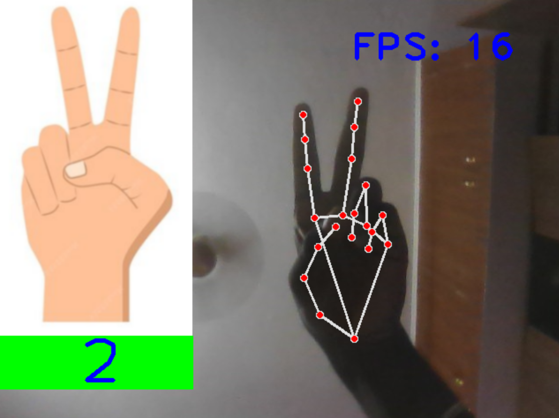

# Finger Counter using Mediapipe and OpenCV

 This Python script utilizes the OpenCV library to perform real-time hand gesture recognition using a webcam. It employs a pre-trained hand detection model from the HandTrackingModule to detect and track landmarks on the hand.

 